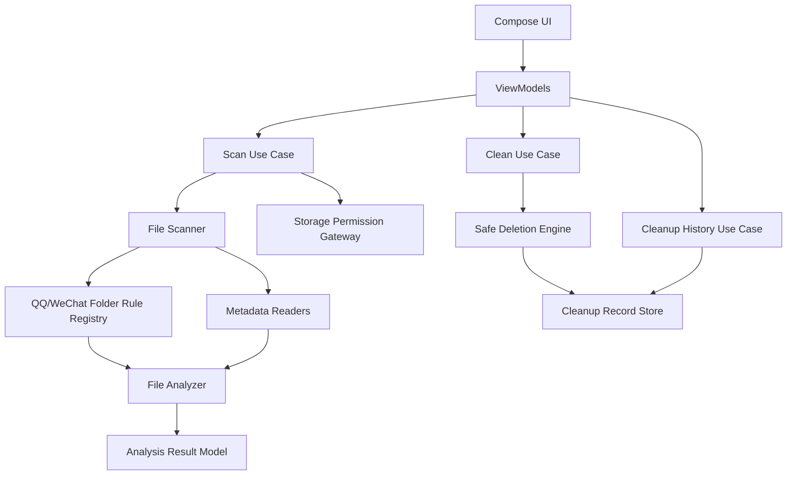

# Cleanner App Design

## Summary

Cleanner is a personal Android app for scanning QQ and WeChat files on a Redmi phone, explaining what the discovered folders and files are used for, and letting the user choose what to delete.

The first version will prioritize strong local scanning and clear explanations over app-store compliance. It will request all-files access for personal use, analyze files locally, and never delete anything without explicit user selection and confirmation.

## Product Direction

The app starts with approach B: a file-audit-style cleaner. It should scan broadly, explain carefully, and leave cleanup decisions to the user. The architecture should leave room for approach C later, including duplicate detection, similar media analysis, and smarter local analysis.

Primary goals:

- Scan QQ and WeChat related storage locations on the user's Redmi Android phone.
- Explain what each recognized folder usually stores.
- Explain what each file appears to be and why it may or may not be cleanable.
- Classify files by app, folder purpose, file type, risk level, and cleanup recommendation.
- Allow bulk selection, manual review, and confirmed deletion.
- Save cleanup records only, not full scan history.

Out of scope for the first version:

- Cloud upload or remote analysis.
- Silent one-tap deletion without confirmation.
- Reading private chat database content.
- Account-level chat analysis.
- Google Play compliant permission flow.
- Automatic scheduled cleanup.

## Distribution And Permission Strategy

The first version is for personal or friend installation, not app-store distribution. It should use Android all-files access when available.

Implementation direction:

- Declare and request `MANAGE_EXTERNAL_STORAGE`.
- Guide the user to the system settings page for all-files access.
- Check permission state with `Environment.isExternalStorageManager()`.
- Continue only after permission is granted.

Important Android storage constraints:

- All-files access improves broad shared-storage scanning for personal use.
- Even with all-files access, modern Android may still restrict other apps' private app-specific directories.
- Shared locations such as external storage and `Android/media` should be part of the scan strategy.
- The permission module must be isolated so a future directory-grant or app-store-friendly mode can replace it.

Reference:

- Android all-files access documentation: https://developer.android.com/training/data-storage/manage-all-files

## Functional Flow

### 1. Permission Page

Shown on first launch or when permission is missing.

Requirements:

- Explain why all-files access is needed.
- State that scanning is local-only.
- State that files are never uploaded.
- State that deletion requires user confirmation.
- Provide a button to open the Android permission settings screen.
- Re-check permission when the user returns to the app.

### 2. Home Page

Acts as the control center.

Display before scan:

- WeChat scan status.
- QQ scan status.
- Start scan button.
- Most recent cleanup summary if available.

Display after scan:

- Total scanned size.
- Suggested cleanable size.
- Review-required size.
- App-level breakdown for QQ and WeChat.
- Entry point to analysis results.

### 3. Scan Progress Page

Displays live scan progress.

Requirements:

- Current app being scanned.
- Current folder path or friendly folder label.
- Number of files discovered.
- Total size discovered.
- Cancel action.

If the scan is cancelled, keep partial results in memory and mark them as incomplete.

### 4. Analysis Results Page

This is the main product surface.

Information hierarchy:

1. App: WeChat, QQ, or all.
2. Folder purpose group.
3. File category.
4. Individual files.

Top summary:

- Total size.
- Suggested cleanable size.
- Currently selected size.
- Selected file count.

Filters:

- Suggested clean.
- Review required.
- Images.
- Videos.
- Documents.
- APK packages.
- Cache.
- Logs.
- Unknown.
- Large files.

Folder cards must include:

- Folder display name.
- Folder purpose explanation.
- App owner.
- Total size.
- File count.
- Risk summary.
- Expand/collapse control.

File rows must include:

- Selection checkbox.
- File name.
- Category.
- Size.
- Modified time.
- Metadata summary when available.
- Short explanation.
- Risk level.

### 5. File Detail Page

Displays one file with enough context for manual decision making.

Fields:

- File name.
- Full path.
- App owner.
- Folder purpose.
- File category.
- Size.
- Modified time.
- MIME type or detected type.
- Metadata summary.
- Cleanup recommendation.
- Explanation.
- Selection toggle.

For supported media, show safe metadata such as image dimensions or video duration. Do not read private chat database content.

### 6. Cleanup Confirmation Page

Shown before deletion.

Display:

- Selected file count.
- Estimated freed space.
- Risk distribution.
- Apps included.
- Cancel action.
- Confirm deletion action.

Deletion must not start until the user confirms.

### 7. Cleanup Result Page

Shown after deletion.

Display:

- Successfully deleted count.
- Failed count.
- Freed space.
- Failure reasons.
- Entry point back to home or results.

Save a cleanup record after this page is produced.

## Architecture

Use Kotlin, Jetpack Compose, and MVVM-style presentation. Keep storage, scanning, analysis, deletion, and history as separate modules.

### Storage Permission Gateway

Responsibilities:

- Detect all-files access state.
- Open the system settings screen for permission.
- Report permission state to the UI.
- Hide Android-version-specific permission logic from scan use cases.

Future extension:

- Add directory-grant mode without changing scan result UI.

### File Scanner

Responsibilities:

- Scan Redmi-relevant QQ and WeChat storage roots.
- Recursively collect file facts.
- Support cancellation.
- Report progress.
- Produce `ScannedFile` records only.

The scanner must not decide whether a file is junk. It only reports facts.

### Folder Rule Registry

Responsibilities:

- Match paths to known QQ and WeChat folder purposes.
- Provide user-facing folder explanations.
- Provide confidence and privacy level.

First version rules should be built into the app. Later versions can move rules into configuration files.

### Metadata Readers

Responsibilities:

- Read safe metadata based on file type.
- Handle failures gracefully.
- Avoid reading private chat database content.

Supported first-version metadata:

- Image width, height, format.
- Video duration, width, height.
- APK app name, package name, version.
- Document type.
- Archive entry count if cheap and safe.

### File Analyzer

Responsibilities:

- Combine path rules, file facts, and metadata.
- Assign category.
- Assign cleanup risk level.
- Generate explanations.
- Decide default selection state.

This module is the extension point for future smarter analysis.

### Safe Deletion Engine

Responsibilities:

- Delete only explicitly selected files.
- Continue deleting remaining files if one deletion fails.
- Return success and failure details.
- Never delete folders recursively unless the exact behavior is added and confirmed later.

### Cleanup Record Store

Responsibilities:

- Save cleanup result summaries.
- Avoid storing complete scan history.
- Store only enough information for the home page and cleanup review.

## Data Model

### FolderProfile

Explains what a folder usually stores.

Fields:

- `app`: WeChat or QQ.
- `pathPattern`: path matching rule.
- `displayName`: friendly folder name.
- `purpose`: user-facing explanation.
- `privacyLevel`: normal, sensitive, or unknown.
- `cleaningHint`: cleanup guidance.
- `confidence`: high, medium, or low.

### ScannedFile

Represents scan facts.

Fields:

- `id`.
- `app`.
- `absolutePath`.
- `parentPath`.
- `name`.
- `extension`.
- `sizeBytes`.
- `lastModifiedAt`.
- `detectedMimeType`.

### FileMetadata

Represents optional type-specific metadata.

Possible values:

- `ImageMetadata`: width, height, format.
- `VideoMetadata`: duration, width, height.
- `ApkMetadata`: app name, package name, version name.
- `ArchiveMetadata`: entry count, compressed size.
- `DocumentMetadata`: document type.
- `UnknownMetadata`.

### AnalyzedFile

Represents the UI-ready analysis result.

Fields:

- `scannedFile`.
- `folderProfile`.
- `category`.
- `riskLevel`.
- `recommendation`.
- `explanation`.
- `metadataSummary`.
- `isDefaultSelected`.

### CleanupRecord

Represents a completed cleanup operation.

Fields:

- `id`.
- `createdAt`.
- `appsIncluded`.
- `deletedFileCount`.
- `failedFileCount`.
- `freedBytes`.
- `riskSummary`.
- `deletedPathSamples`.
- `failureReasons`.

`deletedPathSamples` should contain only a small number of examples or path summaries.

## Classification

### File Categories

Initial categories:

- `Cache`.
- `Thumbnail`.
- `ChatImage`.
- `ChatVideo`.
- `ReceivedFile`.
- `Download`.
- `ApkPackage`.
- `Log`.
- `Temp`.
- `Database`.
- `Unknown`.
- `LargeFile`.
- `DuplicateCandidate`.

`DuplicateCandidate` is reserved for future approach C work.

### Risk Levels

- `SafeToClean`: cache, thumbnails, temporary generated files.
- `LikelyCleanable`: logs, old APK packages, obvious temporary leftovers.
- `ReviewRequired`: chat images, chat videos, received files, large files.
- `KeepRecommended`: databases, configuration files, unknown sensitive files.

### Default Selection

Default behavior:

- `SafeToClean`: selected by default.
- `LikelyCleanable`: selected by default.
- `ReviewRequired`: not selected by default.
- `KeepRecommended`: never selected by default.

High-risk files must require deliberate user selection.

## Error Handling

Required cases:

- Permission missing: show permission page and do not scan.
- Permission revoked: return to permission flow.
- Directory missing: show "not found" for that app or folder, not an error crash.
- Scan cancelled: keep partial results and mark scan as incomplete.
- Metadata read failure: show the file without detailed metadata.
- File deleted by another app before cleanup: skip and record "file not found".
- Permission denied during deletion: record failure and continue.
- Storage temporarily unavailable: surface a retry option.

## Testing Strategy

Automated tests:

- `FolderRuleRegistry` path matching tests.
- `FileAnalyzer` classification and risk-level tests.
- Metadata reader tests using fixture files where practical.
- Safe deletion tests using temporary files.
- Cleanup record serialization tests.
- ViewModel state tests for permission missing, scanning, scan complete, cancelled scan, and cleanup failure.

Manual tests:

- Run on the user's Redmi phone.
- Scan installed WeChat and QQ storage.
- Compare discovered directories with actual file manager view.
- Update folder rules based on observed paths.
- Delete a small controlled set of cache files first.
- Verify cleanup record and freed-space summary.

## Implementation Milestones

1. Create Android project skeleton with Kotlin, Jetpack Compose, navigation, and app theme.
2. Implement permission gateway and all-files access onboarding.
3. Implement scanner interfaces, progress model, cancellation, and Redmi QQ/WeChat scan roots.
4. Implement folder rule registry, metadata readers, and file analyzer.
5. Build home, permission, scanning, analysis list, file detail, confirmation, and result screens.
6. Implement safe deletion and cleanup record store.
7. Add tests for rules, analyzer, deletion, history, and ViewModel states.
8. Run first Redmi device test and refine QQ/WeChat path rules.

## Open Extension Points

Future approach C features should be added behind interfaces:

- Duplicate file detection by hash or fast fingerprint.
- Similar image grouping.
- Large-file age scoring.
- Local model or heuristic explanation engine.
- Configurable folder-rule updates.
- Optional directory-grant scanning mode for a more compliant distribution path.

These should extend the analyzer and metadata layers without changing the core UI flow.
